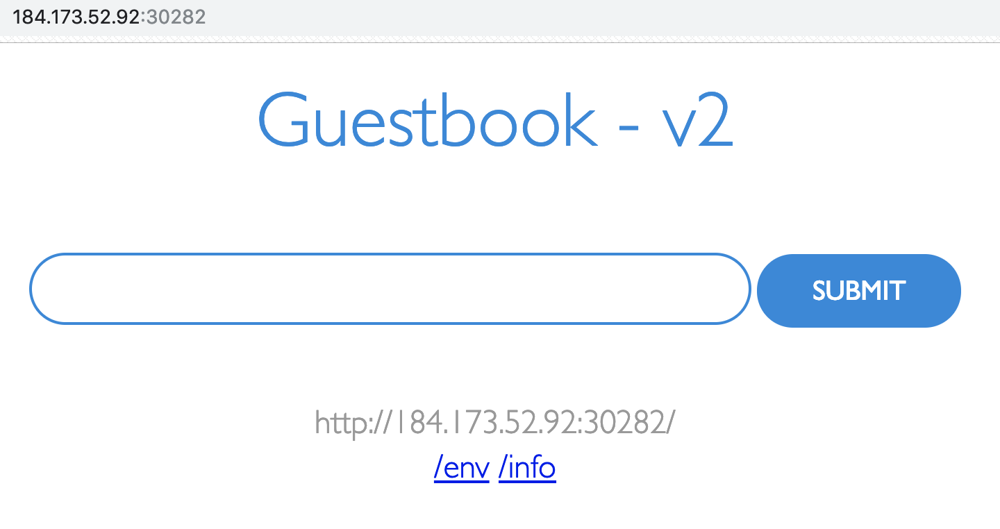

# Lab 2) アプリケーションのスケーリング と アップデート&ロールバック

Lab2では，「アプリケーションのスケーリング」と「アップデート&ロールバック」する方法を学びます。  

Lab2を実施するには，`guestbook` アプリケーションのDeploymentおよびServiceが動作している必要があります。以下の手順で `Deployment` や `Service` をデプロイしてください。

実行例:

```bash
$ kubectl run guestbook --image=ibmcom/guestbook:v1
$ kubectl expose deployment guestbook --type="NodePort" --port=3000
```

## 1. レプリカ数(replica)の指定によるアプリケーションのスケーリング
一般的に，同じアプリケーションを複数稼働させることで，負荷増大や障害に対しての可用性を高めることができます。  
K8sでは`ReplicaSet` によって，Pod(Deployment)の複製が可能です。

1. `kubectl` CLI には `scale` というサブコマンドがあり、これを使うと既存のDeployment数を変更できます。  
現在は1インスタンスで動作している `guestbook` を 10インスタンスで動作するように複製してみましょう。

    実行例:

    ```bash
    $ kubectl scale --replicas=10 deployment guestbook
    deployment.extensions/guestbook scaled
    ```

   >補足:  
   > Kubernetesのコントローラは，宣言された値(`desired state`，この場合は`--replicas=10`)を満たすように動きます。今回のケースでは，既に1つのインスタンスが動作しているため，9つの新しいPodを作成することで，10インスタンスという`desired state` を満たすように動作することになります。

2. スケーリング(ロールアウト)していく様子を以下のコマンドで確認してみましょう。

    `kubectl rollout status deployment guestbook`

    実行例:

    ```bash
    $ kubectl rollout status deployment guestbook
    Waiting for deployment "guestbook" rollout to finish: 1 of 10 updated replicas are available...
    Waiting for deployment "guestbook" rollout to finish: 2 of 10 updated replicas are available...
    Waiting for deployment "guestbook" rollout to finish: 3 of 10 updated replicas are available...
    Waiting for deployment "guestbook" rollout to finish: 4 of 10 updated replicas are available...
    Waiting for deployment "guestbook" rollout to finish: 5 of 10 updated replicas are available...
    Waiting for deployment "guestbook" rollout to finish: 6 of 10 updated replicas are available...
    Waiting for deployment "guestbook" rollout to finish: 7 of 10 updated replicas are available...
    Waiting for deployment "guestbook" rollout to finish: 8 of 10 updated replicas are available...
    Waiting for deployment "guestbook" rollout to finish: 9 of 10 updated replicas are available...
    deployment "guestbook" successfully rolled out
    ```

3. Podの動作状況を次のコマンドで確認します。

    `kubectl get pods`

    実行例:

    ```bash
    $ kubectl get pods
    NAME                         READY   STATUS    RESTARTS   AGE
    guestbook-75786d799f-4dj4q   1/1     Running   0          3m
    guestbook-75786d799f-6bcbm   1/1     Running   0          3m
    guestbook-75786d799f-6tfrt   1/1     Running   0          3m
    guestbook-75786d799f-7lh95   1/1     Running   0          3m
    guestbook-75786d799f-8qf56   1/1     Running   0          5m
    guestbook-75786d799f-hrw2v   1/1     Running   0          3m
    guestbook-75786d799f-lb9r2   1/1     Running   0          3m
    guestbook-75786d799f-mf5x9   1/1     Running   0          3m
    guestbook-75786d799f-n5tw5   1/1     Running   0          3m
    guestbook-75786d799f-x22sx   1/1     Running   0          3m
    ```

    Podの数が10になっていることが確認できます。

    >補足:  
    > Podの数を増やす以外に可用性を向上させる方法として，
    > [複数のクラスター構成や複数のデータセンターによる冗長化](https://console.bluemix.net/docs/containers/cs_planning.html#cs_planning_cluster_config)があります。
    > 同一データセンター内で複数クラスターしたり，複数のデータセンターに同一K8sクラスターを動作させることでより高可用な構成をとることが可能です。
    > 
    > 

## 2. アプリケーションのアップデートとロールバック
K8sは，アプリケーションを新しいバージョンのコンテナイメージにローリングアップデートする機能を提供します。  
これにより動作中のコンテナイメージを無停止でアップデートしたり，問題が起きた場合に前のバージョンに戻すロールバックを簡易に実現できます。

いままでは， `v1` タグが付与されたイメージを使用していました。

`$ kubectl run guestbook --image=ibmcom/guestbook:v1`

新しいバージョンの`v2`のコンテナイメージにアップデートしてみましょう。また、`v2`に変更した後再度`v1`に切り戻すロールバックも実施します。

- v1からv2のコンテナイメージへのアップデート
- v2からv1のコンテナイメージへのロールバック

## v2のコンテナイメージへのアップデート
1. `kubectl` コマンドと `set` サブコマンドを使用して，`v2` のイメージを使用するように Deploymentをアップデートします。 

    実行例:
    
    ```bash
    $ kubectl set image deployment/guestbook guestbook=ibmcom/guestbook:v2
    deployment.extensions/guestbook image updated
    ```

2. 古いDeploymentが削除され，新しいバージョンにアップデートされていく様子を以下のコマンドで確認します。

    `$ kubectl rollout status deployment/guestbook`

   ```bash
   $ kubectl rollout status deployment/guestbook
    Waiting for deployment "guestbook" rollout to finish: 5 out of 10 new replicas have been updated...
    Waiting for deployment "guestbook" rollout to finish: 5 out of 10 new replicas have been updated...
    Waiting for deployment "guestbook" rollout to finish: 5 out of 10 new replicas have been updated...
    Waiting for deployment "guestbook" rollout to finish: 5 out of 10 new replicas have been updated...
    Waiting for deployment "guestbook" rollout to finish: 5 out of 10 new replicas have been updated...
    Waiting for deployment "guestbook" rollout to finish: 6 out of 10 new replicas have been updated...
    Waiting for deployment "guestbook" rollout to finish: 6 out of 10 new replicas have been updated...
    Waiting for deployment "guestbook" rollout to finish: 6 out of 10 new replicas have been updated...
    Waiting for deployment "guestbook" rollout to finish: 7 out of 10 new replicas have been updated...
    Waiting for deployment "guestbook" rollout to finish: 7 out of 10 new replicas have been updated...
    Waiting for deployment "guestbook" rollout to finish: 7 out of 10 new replicas have been updated...
    Waiting for deployment "guestbook" rollout to finish: 7 out of 10 new replicas have been updated...
    Waiting for deployment "guestbook" rollout to finish: 7 out of 10 new replicas have been updated...
    Waiting for deployment "guestbook" rollout to finish: 8 out of 10 new replicas have been updated...
    Waiting for deployment "guestbook" rollout to finish: 8 out of 10 new replicas have been updated...
    Waiting for deployment "guestbook" rollout to finish: 8 out of 10 new replicas have been updated...
    Waiting for deployment "guestbook" rollout to finish: 8 out of 10 new replicas have been updated...
    Waiting for deployment "guestbook" rollout to finish: 8 out of 10 new replicas have been updated...
    Waiting for deployment "guestbook" rollout to finish: 9 out of 10 new replicas have been updated...
    Waiting for deployment "guestbook" rollout to finish: 9 out of 10 new replicas have been updated...
    Waiting for deployment "guestbook" rollout to finish: 9 out of 10 new replicas have been updated...
    Waiting for deployment "guestbook" rollout to finish: 3 old replicas are pending termination...
    Waiting for deployment "guestbook" rollout to finish: 3 old replicas are pending termination...
    Waiting for deployment "guestbook" rollout to finish: 3 old replicas are pending termination...
    Waiting for deployment "guestbook" rollout to finish: 2 old replicas are pending termination...
    Waiting for deployment "guestbook" rollout to finish: 2 old replicas are pending termination...
    Waiting for deployment "guestbook" rollout to finish: 2 old replicas are pending termination...
    Waiting for deployment "guestbook" rollout to finish: 1 old replicas are pending termination...
    Waiting for deployment "guestbook" rollout to finish: 1 old replicas are pending termination...
    Waiting for deployment "guestbook" rollout to finish: 1 old replicas are pending termination...
    Waiting for deployment "guestbook" rollout to finish: 8 of 10 updated replicas are available...
    Waiting for deployment "guestbook" rollout to finish: 9 of 10 updated replicas are available...
    deployment "guestbook" successfully rolled out
   ```
   
   >補足:  
   >上記の出力はv2のコンテナイメージに置き換わっている間に出力されるものです。v2のコンテナイメージ適用が完全に終了した後に`$ kubectl rollout status xxx`を実行した場合は，`deployment "guestbook" successfully rolled out`とだけ表示されます。

3. ブラウザ上でアプリケーションの動作を確認します。

    ブラウザで`<Public IP>:<NodePort>`を開きます。
    
    >補足:  
    > ワーカーノードの `Public IP` は以下のように確認します。
    > ```
    > $ ibmcloud cs workers mycluster
    > OK
    > ID                                                 Public IP       Private IP      Machine Type   State    Status   Zone    Version
    > kube-hou02-pa705552a5a95d4bf3988c678b438ea9ec-w1   184.173.52.92   10.76.217.175   free           normal   Ready    hou02   1.10.12_1543
    > ```
    > `NodePort` は以下のように確認します。
    > ```
    > $ kubectl get service guestbook
    > NAME        TYPE       CLUSTER-IP       EXTERNAL-IP   PORT(S)          AGE
    > guestbook   NodePort   172.21.247.149   <none>        3000:30282/TCP   14m
    > ```
    > 上記の出力例の場合の `<Public IP>:<NodePort>`は，次のようになります。
    > - Public IP: `184.173.52.92`
    > - NodePort: `30282`
    > 
    > したがって，ブラウザ上で `184.173.52.92:30282` にアクセスするとアプリケーションが開きます。

    guestbook アプリの "v2" が動作していることを確認してください。
    下図のように，ページタイトルの文字列が `Guestbook - v2` に変更されているはずです。
    
    

## v1のコンテナイメージへのロールバック
v2のコンテナイメージに置き換わりましたが、再度v1のイメージにロールバックさせます。

1. 直前の状態(v1のコンテナイメージ)にロールバックします。

    ```bash
    $ kubectl rollout undo deployment guestbook
    deployment.extensions/guestbook
    ```

2. v2のコンテナからv1のコンテナにロールアウトしていく様子を確認します。

    ```bash
    $ kubectl rollout status deployment/guestbook
    Waiting for deployment "guestbook" rollout to finish: 5 out of 10 new replicas have been updated...
    Waiting for deployment "guestbook" rollout to finish: 5 out of 10 new replicas have been updated...
    Waiting for deployment "guestbook" rollout to finish: 5 out of 10 new replicas have been updated...
    Waiting for deployment "guestbook" rollout to finish: 5 out of 10 new replicas have been updated...
    Waiting for deployment "guestbook" rollout to finish: 6 out of 10 new replicas have been updated...
    Waiting for deployment "guestbook" rollout to finish: 6 out of 10 new replicas have been updated...
    Waiting for deployment "guestbook" rollout to finish: 6 out of 10 new replicas have been updated...
    Waiting for deployment "guestbook" rollout to finish: 7 out of 10 new replicas have been updated...
    Waiting for deployment "guestbook" rollout to finish: 7 out of 10 new replicas have been updated...
    Waiting for deployment "guestbook" rollout to finish: 7 out of 10 new replicas have been updated...
    Waiting for deployment "guestbook" rollout to finish: 7 out of 10 new replicas have been updated...
    Waiting for deployment "guestbook" rollout to finish: 8 out of 10 new replicas have been updated...
    Waiting for deployment "guestbook" rollout to finish: 8 out of 10 new replicas have been updated...
    Waiting for deployment "guestbook" rollout to finish: 8 out of 10 new replicas have been updated...
    Waiting for deployment "guestbook" rollout to finish: 8 out of 10 new replicas have been updated...
    Waiting for deployment "guestbook" rollout to finish: 8 out of 10 new replicas have been updated...
    Waiting for deployment "guestbook" rollout to finish: 9 out of 10 new replicas have been updated...
    Waiting for deployment "guestbook" rollout to finish: 9 out of 10 new replicas have been updated...
    Waiting for deployment "guestbook" rollout to finish: 9 out of 10 new replicas have been updated...
    Waiting for deployment "guestbook" rollout to finish: 9 out of 10 new replicas have been updated...
    Waiting for deployment "guestbook" rollout to finish: 9 out of 10 new replicas have been updated...
    Waiting for deployment "guestbook" rollout to finish: 3 old replicas are pending termination...
    Waiting for deployment "guestbook" rollout to finish: 3 old replicas are pending termination...
    Waiting for deployment "guestbook" rollout to finish: 3 old replicas are pending termination...
    Waiting for deployment "guestbook" rollout to finish: 2 old replicas are pending termination...
    Waiting for deployment "guestbook" rollout to finish: 2 old replicas are pending termination...
    Waiting for deployment "guestbook" rollout to finish: 2 old replicas are pending termination...
    Waiting for deployment "guestbook" rollout to finish: 1 old replicas are pending termination...
    Waiting for deployment "guestbook" rollout to finish: 1 old replicas are pending termination...
    Waiting for deployment "guestbook" rollout to finish: 1 old replicas are pending termination...
    Waiting for deployment "guestbook" rollout to finish: 8 of 10 updated replicas are available...
    Waiting for deployment "guestbook" rollout to finish: 9 of 10 updated replicas are available...
    deployment "guestbook" successfully rolled out
    ```
   
    >補足:  
    >先ほどと同様，完全にロールアウトが完了した後に`$ kubectl rollout status xxx`を実行すると，`deployment "guestbook" successfully rolled out`とだけ表示されます。
   
5. 最終的に動作しているPod(v1のコンテナ群)を管理している `ReplicaSet` を確認します。

    異なるバージョンのコンテナイメージを適用してロールアウト実行する際に，K8sリソースの一つである `ReplicaSet` が使用されています。
    
    ```bash
    $ kubectl get replicasets -l run=guestbook
    NAME                   DESIRED   CURRENT   READY   AGE
    guestbook-58d97f854    0         0         0       28m
    guestbook-75786d799f   10        10        10      30m
    ```
    
    READYが0の`ReplicaSet`と10の`ReplicaSet`の2つが表示されました。
    上記の例の場合は，
    `guestbook-75786d799f` がv1のコンテナイメージを指定しているグループのReplicaSetです。
    
    `ibmcom/guestbook:v1`の指定箇所は，以下のように `kubectl describe`を使って詳細情報から得られます。
    
    ```bash
    $ kubectl describe replicasets guestbook-75786d799f
    .
    .
    (省略)
    .
    .
    Pod Template:
      Labels:  pod-template-hash=3134283559
           run=guestbook
      Containers:
       guestbook:
        Image:        ibmcom/guestbook:v1
        Port:         <none>
        Host Port:    <none>
    .
    .
    (省略)
    ```

    >補足:  
    > Kubernetesには，様々なK8sリソースが存在します。(Pod/ReplicaSet/Deployment/Service etc..)
    > Lab2では，Deploymentというリソースが，2種類のReplicaSet(v1コンテナ群を管理するものと，v2コンテナ群を管理するもの)のライフサイクル管理をしてくれていました。そしてそのReplicaSetがguestbookコンテナの動くPodを管理しています。

以上で「アプリケーションのスケーリング」および「アップデート & ロールバック」の操作は完了です。

最後に， **Lab2で作成したK8sリソースを以下のコマンドで削除** します。

  ```bash
  1) Deploymentを削除する
  $ kubectl delete deployment guestbook

  2) Serviceを削除する
  $ kubectl delete service guestbook

  3) 確認する
  $ kubectl get pods  
  ```

次のハンズオンはこちら [Lab3](../Lab3/README.md) です。
