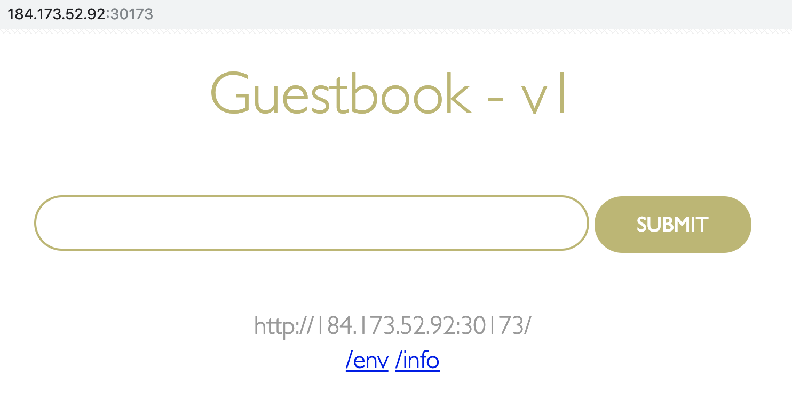
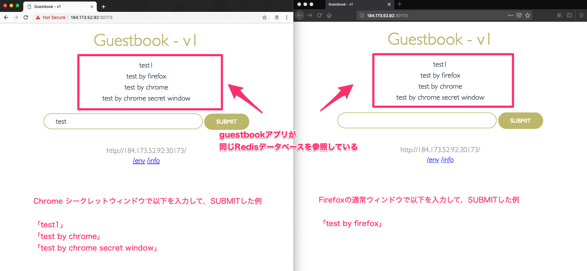

# Lab 3) マニフェストファイルの使用とRedisデータベースコンテナとの連携
Lab3では，マニフェストファイルを使用して宣言的にアプリケーションをデプロイする方法を学びます。  
また，複数のコンテナを連携させて利用する方法も学びます。

使用するアプリケーションは，Lab 1，2で使用してきた`guestbook`アプリケーションと同じものです。
Lab1，2では，`kubectl run`コマンドなど逐次コマンドを入力し`Pod`を作成・開始してきましたが，Lab3ではマニフェストファイル(構成ファイル)を使用してアプリケーションのデプロイを行います。  

マニフェストファイルを使用することで，Kubernetesのコントローラーはファイルに記述されている`desired state`(宣言的に指定した状態)を満たすよう動きます。
つまり，「**宣言的** かつ，よりきめ細やかなりソース管理」をシンプルに実現することが可能になります。
これがKubernetesを利用する最大の理由と言っても過言ではありません。

Lab 3では大きく以下の2つを体験します。

- **1. マニフェストファイルを使用したアプリケーションのデプロイとスケーリング**
- **2. Redisコンテナを追加し`guestbook`アプリケーションと連携**

## 0. 事前準備 (リポジトリのクローン)
まずはソースコードをGitHubからクローンして，該当ディレクトリに移動してください。
複数バージョンの`guestbook`アプリケーションをKubernetes上にデプロイするためのマニフェストファイル(.yaml)を配置しています。

```bash
マニフェストファイルが用意されているリポジトリのクローンとディレクトリ移動

$ git clone https://github.com/capsmalt/guestbook.git
$ cd guestbook/v1
```

## 1. マニフェストファイルを使用したアプリケーションのデプロイとスケーリング
ここでは以下の3つの操作を実施します。

- `guestbook-deployment.yaml` を使って `guestbook-v1`という名前のdeploymentを作成しアプリケーションをデプロイする (replicas=3 指定済)
- `guestbook-deployment.yaml` を編集して **3台**構成から**5台**構成にスケーリングさせる
- `guestbook-service.yaml` を使って `guestbook` という名前のserviceを作成し外部からアクセス可能な状態にする

上記の操作はコマンドを数回実行するだけで終わりますが，この章では yamlファイルの中身に目を通して，マニフェストファイルがどのようなものか理解してください。

### まずは，`guestbook`アプリケーションの`deployment`の構成を見てみましょう。

1. **guestbook/v1/guestbook-deployment.yaml**  を任意のエディタで開きます。  

  ```yaml
  apiVersion: apps/v1
  kind: Deployment
  metadata:
    name: guestbook-v1
    labels:
      app: guestbook
      version: "1.0"
  spec:
    replicas: 3
    selector:
      matchLabels:
        app: guestbook
    template:
      metadata:
        labels:
          app: guestbook
          version: "1.0"
      spec:
        containers:
        - name: guestbook
          image: ibmcom/guestbook:v1
          ports:
          - name: http-server
            containerPort: 3000
  ```

  上記の構成ファイルでは，`guestbook-v1`という名前の`deployment`オブジェクトを作成しています。  
  Deployment定義の場合は `spec: `にレプリカ数や，使用するコンテナイメージ，ポートなどを指定します。
  今回の例では`deployment`の構成要素として`ibmcom/guestbook:v1`というコンテナイメージが指定され，これが`Pod`として生成されます。
  また，`Replicaset`として`Pod`の数が3つに指定(`replicas: 3`)されているため，Kubernetesは常に3つのアクティブな`Pod`が動作するよう動きます。

  >補足:  
  > Kubernetesオブジェクトを作成する際には，yamlファイル内で`apiVersion`や`kind`，`metadata`，`name`，`labels`，`namespace`などを指定します。今回のようにdeploymentオブジェクトを生成する際は`kind: Deployment`のように指定します。他にも`Service`や`Pod`，`ConfigMap`，その他Kubernetesリソースの種類を指定することでマニフェストファイルから各種オブジェクトを作成できます。

2. `guestbook`の`deployment`オブジェクトの作成します。  

  上記で確認したマニフェストファイルを使用して`deployment`を作成します。  
  マニフェストファイルを使用する場合は`-f`オプションを付与してファイル名を指定します。

  実行例:

  ```bash
  $ kubectl create -f guestbook-deployment.yaml
  deployment.apps/guestbook-v1 created
  ```

3. ラベル(`label`)が `app=guestbook` であるPod一覧を表示します。  
  生成済の全てのPodの中から，labelが "app" で，その値が "guestbook" であるPodを一覧表示させてみます。
  labelは，マニフェストファイル(yaml)内の `spec.template.metadata.labels` という項目の値を指します。

  実行例:

  ```bash
  $ kubectl get pods -l app=guestbook
  NAME                           READY   STATUS    RESTARTS   AGE
  guestbook-v1-7fc76dc46-dcjwg   1/1     Running   0          18m
  guestbook-v1-7fc76dc46-f7tzx   1/1     Running   0          18m
  guestbook-v1-7fc76dc46-zgckk   1/1     Running   0          18m
  ```

  >補足1:
  >先ほど確認したマニフェストファイルには`labels: `表記が2ヶ所にありますが，それぞれdeploymentを区別するためのlabelとpodを区別するためのlabelとなっています。今回は`kubectl get pods`コマンドを実行しているためpodのlabelが`app=guestbook`となっているものが返ってきます。  

### マニフェストファイルのレプリカ数を編集してPodをスケーリングさせてみましょう。

4. マニフェストファイルを変更してPodをスケーリングさせてみましょう。

  **guestbook/v1/guestbook-deployment.yaml** を任意のエディタで開いて `spec.replicas` の値を `replicas: 5` に変更します。

  ```yaml
  ...
  spec:
    replicas: 5
    selector:
      matchLabels:
        app: guestbook
  ...
  ```

5. 変更内容をクラスターに反映させます。

  実行例:

  ```bash
  $ kubectl apply -f guestbook-deployment.yaml
  Warning: kubectl apply should be used on resource created by either kubectl create --save-config or kubectl apply
  deployment.apps/guestbook-v1 configured
  ```

6. 再度，Pod一覧を表示します。

  実行例:

  ```bash
  $ kubectl get pods -l app=guestbook
  NAME                           READY   STATUS    RESTARTS   AGE
  guestbook-v1-7fc76dc46-592gm   1/1     Running   0          1m
  guestbook-v1-7fc76dc46-dcjwg   1/1     Running   0          26m
  guestbook-v1-7fc76dc46-f7tzx   1/1     Running   0          26m
  guestbook-v1-7fc76dc46-k7nnq   1/1     Running   0          1m
  guestbook-v1-7fc76dc46-zgckk   1/1     Running   0          26m
  ```

  Podの数が5つに増えていることが確認できます。一番右側の`AGE`列を見るとが2つだけ新しくなっていますね。  

  >補足1:  
  > Kubernetesでは，基本的に全てのKubernetesリソースはマニフェストファイルを使用して管理できます。したがって，マニフェストファイルをバージョン管理すると，ある時点での状態をいつでも再現できるようになります。しかし一方で，各Kubernetesリソースタイプごとに管理していくことの複雑さや手間の問題も指摘されています。この問題の解決策としてHelmやKustomize，Kssonetなど様々なツールを活用している事例もありますので，興味のある方はぜひ調査してみてください。
  
  >補足2:  
  > `kubectl edit` で直接編集することもできます。
  > ```bash
  > $ kubectl edit deployment guestbook-v1
  > 
  > "replicas: 3" のように変更しても良いです。
  > 未編集の場合は，":q"で終了します。
  > 変更を加えた場合は，":wq"で保存するか，":q!"で変更をキャンセルします。
  > ```
  > 変更している場合は， `$ kubectl get pods -l app=guestbook` で確認してみましょう。
  > Kubernetesが状態変更を適用させるべく，Podのインスタンスを増減させている様子が見れるはずです。
  > 
  > 実行例:
  > ```bash
  > $ kubectl get pods -l app=guestbook
  > NAME                           READY   STATUS        RESTARTS   AGE
  > guestbook-v1-7fc76dc46-592gm   0/1     Terminating   0          3m
  > guestbook-v1-7fc76dc46-dcjwg   1/1     Running       0          28m
  > guestbook-v1-7fc76dc46-f7tzx   1/1     Running       0          28m
  > guestbook-v1-7fc76dc46-k7nnq   0/1     Terminating   0          3m
  > guestbook-v1-7fc76dc46-zgckk   1/1     Running       0          28m
  > 
  > 少しだけ間を置いてから再度実行します。
  > 
  > $ kubectl get pods -l app=guestbook
  > NAME                           READY   STATUS    RESTARTS   AGE
  > guestbook-v1-7fc76dc46-dcjwg   1/1     Running   0          29m
  > guestbook-v1-7fc76dc46-f7tzx   1/1     Running   0          29m
  > guestbook-v1-7fc76dc46-zgckk   1/1     Running   0          29m
  > ```
  > 上記の例のようにレプリカ数3の状態になったことが確認できるはずです。


### 次に，guestbokアプリケーションのserviceの構成を見てみましょう。

7. **guestbook/v1/guestbook-service.yaml**  を任意のエディタで開きます。  

  ```yaml
  apiVersion: v1
  kind: Service
  metadata:
    name: guestbook
    labels:
      app: guestbook
  spec:
    ports:
    - port: 3000
      targetPort: http-server
    selector:
      app: guestbook
    type: NodePort
  ```

上記の構成では，`guestbook`という名前の`service`オブジェクトを作成します。`Service`はアプリケーションに対するトラフィック，すなわちクラスター内の別の`Pod`やクラスター外部からくるのトラフィックのためのネットワークパスを作成する際に使われます。今回はクラスター上の`3000番ポート`からのルートをアプリケーションの `http-serverポート` に指定しています。

> さらに上記では`type: NodePort`とすることで外部からアクセスが可能になるよう設定しています。

8. `guestbook-v1`deploymentを作成した時と同じコマンドを使って，`guestbook-service`serviceを作成しましょう。

  実行例:

  ```bash
  $ kubectl create -f guestbook-service.yaml
  service/guestbook created
  ```
  
9. ブラウザ上で以下のURLからguestbookアプリの動作をテストします。

    ブラウザで`<Public IP>:<NodePort>`を開きます。
    
    >補足:  
    > ワーカーノードの `Public IP` は以下のように確認します。
    > ```
    > $ ibmcloud cs workers mycluster
    > OK
    > ID                                                 Public IP       Private IP      Machine Type   State    Status   Zone    Version
    > kube-hou02-pa705552a5a95d4bf3988c678b438ea9ec-w1   184.173.52.92   10.76.217.175   free           normal   Ready    hou02   1.10.12_1543
    > ```
    > `NodePort` は以下のように確認します。
    > ```
    > $ kubectl get service guestbook
    > NAME        TYPE       CLUSTER-IP       EXTERNAL-IP   PORT(S)          AGE
    > guestbook   NodePort   172.21.180.240   <none>        3000:30173/TCP   3m
    > ```
    > 上記の出力例の場合の `<Public IP>:<NodePort>`は，次のようになります。
    > - Public IP: `184.173.52.92`
    > - NodePort: `30173`
    > 
    > したがって，ブラウザ上で `184.173.52.92:30173` にアクセスするとアプリケーションが開きます。

    guestbook アプリの "v1" が動作していることを確認してください。
    
    

以上の操作で，マニフェストファイル(yaml)で`deployment(guestbook-v1)`と`service(guestbook)`をKubernetes上に展開し，さらに外部からアクセス可能なguestbookアプリケーションを動作させることができました。またyamlを編集することで，Kubernetesが`desired state (宣言的に指定した状態)`を維持させるように動作することを確認できました。

> 補足:  
> Kubernetesが`desired state`を維持するように動作していることを別の角度から確認することもできます。
>
> Deployment作成時に使用したマニフェストファイルでは，常に3つのアクティブなPodが動作するよう動くよう設定していますが，もし障害が起こってPodが落ちてしまったときに，どのような挙動をするのかみてみましょう。  
>  
> 稼働中のPodを意図的に削除することで擬似的に障害を生じさせます。  
> 稼働中のPod名のうち1つを選択し(今回の例では`guestbook-v1-7fc76dc46-dcjwg`)，これを引数として以下のコマンドを実行します。
>
> ```bash
> $ kubectl delete pod guestbook-v1-7fc76dc46-dcjwg
> pod "guestbook-v1-7fc76dc46-dcjwg" deleted
> ```
>
> 再度Podの一覧を表示してみます。
>
> ```bash
> $ kubectl get pods -l app=guestbook
> NAME                           READY   STATUS    RESTARTS   AGE
> guestbook-v1-7fc76dc46-mdzbk   1/1     Running   0          5s
> guestbook-v1-7fc76dc46-f7tzx   1/1     Running   0          31m
> guestbook-v1-7fc76dc46-zgckk   1/1     Running   0          31m
> ```
>
> `AGE`が他の2つに比べて新しいPodが表示されるはずです。これは，Podの削除後，新たに作られたものです。
> このようにKubernetesは，常にクラスターの状態を監視し，Deploymentで定義された`desired state`になっているかをチェックしています。そして，状態の差分が見つかると`desired state`を満たすよう動きます。
> 今回の場合はPodを1つ削除したことにより`desired state`である`replicas=3`が満たせなくなったため，すぐに新規にPodを1つ生成したというわけです。

## 2. Redisコンテナを追加してguestbookアプリケーションと連携させる

先ほど作成した`guestbook`アプリケーションは，エントリを登録するとメモリ上でログを保持するようになっています。
インスタンスが1つしか稼働していなければこのままでも特に問題ありませんが、複数のインスタンスにスケールすると不具合が生じる可能性があります。それぞれのインスタンスは自分自身のメモリにのみログを保持するため，ユーザーごとにアクセスするインスタンスが異なると，異なる結果が返ってきてしまうからです。
また，メモリ上でログを保持するということは，インスタンスが何かの障害で落ちてしまうとメモリに書かれていたデータが全て消えてしまうという危険性もはらんでいます。

この問題を解決するためには，データを永続化するためのデータストアを用意し，アプリケーションの全インスタンス間で共有する必要があります。  
今回はRedisデータベースをKubernetesクラスターにデプロイして利用します。Redisインスタンスはguestbookと似たような構成で定義します。

目指す構成イメージは以下です。


ここでは以下の4つの作業を実施します。

- `redis-master-deployment.yaml` を使って `redis-master`という名前のdeploymentを作成しアプリケーションをデプロイする
- `redis-master-service.yaml` を使って `redis-master`という名前のserviceを作成し他のPodからアクセス可能な状態にする
- 複数のguestbookアプリケーションが同一のRedisデータベースに接続することでデータを永続化できることを確認する
- `redis-slave` という名前のRedisデータベースを追加して，読み/書きの役割を複数のRedis間で使い分けられるように構成する

### Redis Masterデータベースのdeploymentを作成しましょう。

1. redis-masterデータベースのdeploymentの構成を見てみましょう。

  **redis-master-deployment.yaml**  を任意のエディタで開きます。  

  ```yaml
  apiVersion: apps/v1
    kind: Deployment
  metadata:
    name: redis-master
    labels:
      app: redis
      role: master
  spec:
    replicas: 1
    selector:
      matchLabels:
        app: redis
        role: master
    template:
      metadata:
        labels:
          app: redis
          role: master
      spec:
        containers:
        - name: redis-master
          image: redis:2.8.23
          ports:
          - name: redis-server
            containerPort: 6379
  ```

  このyamlは，'redis-master' という名前のDeploymentオブジェクトを作成し，Redisデータベースを生成しています。まずはシングルインスタンスで作成したいので，レプリカ数は1に設定しています。
  コンテナイメージは，'redis:2.8.23' を使用し，デフォルトのRedisポート番号である6379番で公開するよう設定しています。

2. Redis MasterデータベースのDeploymentを作成します。

  実行例:

  ```bash
  $ kubectl create -f redis-master-deployment.yaml
  deployment.apps/redis-master created
  ```

3. Redis MasterデータベースのPod動作を確認します。

  実行例:

  ```bash
  $ kubectl get pods -l app=redis,role=master
  NAME                            READY   STATUS    RESTARTS   AGE
  redis-master-5d8b66464f-qjjfn   1/1     Running   0          32s
  ```

4. デプロイしたRedis Masterデータベースが正しく動作するかテストしてみましょう。

  guestbookアプリケーションに接続する前に，Redisデータベース自体が正常に動作するか確認します。
  3.で確認したPod名(上記例では`redis-master-5d8b66464f-qjjfn`)を引数に指定してコマンド実行し，コンテナ内に入って操作します。

  実行例:  
  
  ```bash
  $ kubectl exec -it redis-master-5d8b66464f-qjjfn redis-cli
  127.0.0.1:6379> ping
  PONG
  127.0.0.1:6379> exit
  ```
  >補足:  
  > `kubectl exec -it POD(正確には1つのコンテナ) COMMAND`コマンドは指定したコンテナ内でプロセスを動作させる際に使用します。
  > 今回は，`redis-master-5d8b66464f-qjjfn`というPODのコンテナ内で`redis-cli`コマンドを実行しました。
  > 上記では，正常なら`ping`に対して`PONG`とレスポンスを返してくれる仕組みを使って確認をとっています。

### guestbookアプリケーションからRedis Masterデータベースに接続できるようにserviceを公開しましょう。

5. Redis Masterデータベースのserviceの構成を見てみましょう。

  **redis-master-service.yaml**  を任意のエディタで開きます。  

  ```yaml
  apiVersion: v1
  kind: Service
  metadata:
    name: redis-master
    labels:
      app: redis
      role: master
  spec:
    ports:
    - port: 6379
      targetPort: redis-server
    selector:
      app: redis
      role: master
  ```

  このyamlは，`redis-master`という名前のserviceを作成し，`6379`番ポートで外部公開します。
  また，`selectore`のところで `app=redis`と`role=master`のラベルが指定されたPodをターゲットにルーティングするように構成しています。

6. Redis Masterデータベースを外部公開するServiceを作成します。

  実行例:

  ```bash
  $ kubectl create -f redis-master-service.yaml
  service/redis-master created
  ```

7. guestbookアプリケーションがRedis Masterデータベースを発見できるようにguestbookアプリを再起動します。

  実行例:

  ```bash
  $ kubectl delete deployment guestbook-v1
  deployment.extensions "guestbook-v1" deleted
  
  $ kubectl create -f guestbook-deployment.yaml
  deployment.apps/guestbook-v1 created
  ```

8. ブラウザ上で以下のURLからgurstbookアプリの動作をテストします。

  ブラウザで`<Public IP>:<NodePort>`を開きます。
    
  >補足:  
  > これまでのハンズオンと同様に以下の手順で `Public IP`と`NodePort`の情報を取得できます。
  > ワーカーノードの `Public IP` は以下のように確認します。
  > ```
  > $ ibmcloud cs workers mycluster
  > OK
  > ID                                                 Public IP       Private IP      Machine Type   State    Status   Zone    Version
  > kube-hou02-pa705552a5a95d4bf3988c678b438ea9ec-w1   184.173.52.92   10.76.217.175   free           normal   Ready    hou02   1.10.12_1543
  > ```
  > `NodePort` は以下のように確認します。
  > ```
  > $ kubectl get service guestbook
  > NAME        TYPE       CLUSTER-IP       EXTERNAL-IP   PORT(S)          AGE
  > guestbook   NodePort   172.21.180.240   <none>        3000:30173/TCP   3m
  > ```
  > 上記の出力例の場合の `<Public IP>:<NodePort>`は，次のようになります。
  > - Public IP: `184.173.52.92`
  > - NodePort: `30173`
  > 
  > したがって，ブラウザ上で `184.173.52.92:30173` にアクセスするとアプリケーションが開きます。

  guestbook アプリの "v1" が動作していることを確認してください。

   

### 複数のguestbookアプリケーションが同一のRedisデータベースを使うことで永続化できることを確認しましょう

9. 現在使用しているものとは異なるブラウザを立ち上げてguestbookアプリを開き，動作確認します。

  複数のブラウザで同じguestbookアプリケーションを動作させる必要があります。
  例えば以下のいずれかの方法で試してみましょう。
  
  - 通常ブラウザ と シークレットウィンドウ
  - Firefox と Chrome
  
  複数のブラウザでguestbookアプリケーションを開けたら， それぞれのブラウザ上で **フォームに任意の文字列を入力** します。
  
  以下の図は，Chromeのシークレットウィンドウと，Firefoxを使用した場合の例です。
  
  

  - ブラウザごとに異なるの文字列を入力する
  - 両方のブラウザでページを更新する
  - 同じ入力情報が確認できる
  
  上記の動作を確認できたと思います。
  ここから，全てのPodインスタンスが同一のRedisデータベースに書き込み，全てのインスタンスはguestbookエントリを表示するために同じRedisデータベースから読み出していることがわかります。
  データの永続化ができたことで，トラフィック数の増加に応じてスケールもできるシンプルな3層アプリケーションを実現できました。

  >補足:  
  >今回はデータストアをコンテナとしてデプロイしましたが、実はこのコンテナが落ちてしまうとそこに保持しているデータも消えてしまいます。これを回避するためには，データの保存先をメモリではなくブロックストレージやファイルストレージなどのストレージを置く必要があります。  
  >なお，Kubernetesにおけるデータの永続化の方法はいくつものオプションがあります。今回のようにデータストアをコンテナとして用意する以外にも，クラウドベンダーが提供するマネージドのデータベースサービスや，オブジェクトストレージなども利用できます。利用用途に応じて選択してください。

### `redis-slave` という名前のRedisデータベースを追加して，読み/書きの役割を複数のRedisで使い分けるように構成する

永続化データベースを使用できるようになりましたが，一般的に言われる主なボトルネックは，リクエストを処理するデータベース・サーバーを一つしか持っていないことです。
そこでシンプルな解決策を実施してみましょう。解決策の一つは， **読み/書き用に異なるデータベースを用いて分離することでデータの一貫性を満たす** 方法です。

`redis-slave`という名前のDeploymentを作成し，データの読み出し(read)をするredisデータベースとして動作させます。
スケーリングする際は，`redis-slave`を複数インスタンス用意することで，データベースへのリクエストを分散して処理できるようにします。

目指す構成イメージは以下です。


10. Redis slaveのdeploymentの構成見てみましょう。

  **redis-slave-deployment.yaml**  を任意のエディタで開きます。  

  ```yaml
  apiVersion: apps/v1
  kind: Deployment
  metadata:
    name: redis-slave
    labels:
      app: redis
      role: slave
  spec:
    replicas: 2
    selector:
      matchLabels:
        app: redis
        role: slave
    template:
      metadata:
        labels:
          app: redis
          role: slave
      spec:
        containers:
        - name: redis-slave
          image: kubernetes/redis-slave:v2
          ports:
          - name: redis-server
            containerPort: 6379
  ```

  コンテナイメージとして`image: kubernetes/redis-slave:v2`を指定し，
  `spec.replicas: 2`の部分で，2つのレプリカを生成するように構成されていることが分かります。

11. Redis Slaveデータベースのdeploymentを作成します。

  実行例:

  ```bash
  $ kubectl create -f redis-slave-deployment.yaml
  deployment.apps/redis-slave created
  ```

12. Redis Slaveデータベースの全てのPodが動作しているか確認します。

  実行例:

  ```bash
  $ kubectl get pods -l app=redis,role=slave
  NAME                           READY   STATUS    RESTARTS   AGE
  redis-slave-586b4c847c-kj4q9   1/1     Running   0          1m
  redis-slave-586b4c847c-lw5gj   1/1     Running   0          1m
  ```

13. Redis Slaveのコンテナ内に入り，データベースを正しく閲覧できるか確認します。さらに，slaveとして`read-only`に設定されていることを確認します。

  12.で確認したPod名のうち1つを選択します(上記例では`redis-slave-586b4c847c-kj4q9`)。これを引数に指定してコマンド実行し，コンテナ内に入って操作します。

  実行例:

  ```bash
  $ kubectl exec -it redis-slave-586b4c847c-kj4q9 redis-cli
  127.0.0.1:6379> keys *
  1) "guestbook"
  127.0.0.1:6379> lrange guestbook 0 10
  1) "test1"
  2) "test  by firefox"
  3) "test by chrome"
  4) "test by chrome secret window"
  127.0.0.1:6379> info replication
  # Replication
  role:slave
  master_host:redis-master
  master_port:6379
  master_link_status:up
  master_last_io_seconds_ago:7
  master_sync_in_progress:0
  slave_repl_offset:2339
  slave_priority:100
  slave_read_only:1
  connected_slaves:0
  master_repl_offset:0
  repl_backlog_active:0
  repl_backlog_size:1048576
  repl_backlog_first_byte_offset:0
  repl_backlog_histlen:0
  127.0.0.1:6379> config get slave-read-only
  1) "slave-read-only"
  2) "yes"
  127.0.0.1:6379> exit
  ```

  手順9.で入力した文字列が出力され，正常にデータが保存できていることが確認できます。また，`info replication`コマンドの`role:slave`という出力でこのPodがslaveであることが確認できます。さらに，`conifg get slave-read-only`コマンドでslaveは読み込み専用となるよう設定されています。

  >補足:  
  >`redis-master`は`role:master`となっていることも確認できます。
  >```
  >$ kubectl exec -it redis-master-5d8b66464f-qjjfn redis-cli
  >127.0.0.1:6379> info replication
  ># Replication
  >role:master
  >connected_slaves:2
  >slave0:ip=172.30.78.27,port=6379,state=online,offset=2255,lag=0
  >slave1:ip=172.30.78.28,port=6379,state=online,offset=2255,lag=0
  >master_repl_offset:2255
  >repl_backlog_active:1
  >repl_backlog_size:1048576
  >repl_backlog_first_byte_offset:2
  >repl_backlog_histlen:2254
  >```

14. Redis Slaveデータベースを外部公開するためのServiceの構成を見てみましょう。

  **redis-slave-service.yaml**  を任意のエディタで開きます。  

  ```yaml
  apiVersion: v1
  kind: Service
  metadata:
    name: redis-slave
    labels:
      app: redis
      role: slave
  spec:
    ports:
    - port: 6379
      targetPort: redis-server
    selector:
      app: redis
      role: slave
  ```

15. guestbookアプリからRedis Slaveデータベースに接続するためのServiceを作成します。

  ```bash
  $ kubectl create -f redis-slave-service.yaml
  service/redis-slave created
  ```

16. guestbookアプリケーションがRedis Slaveデータベースに接続できるようguestbookアプリを再起動します。

  実行例:

  ```bash
  $ kubectl delete deploy guestbook-v1
  deployment.extensions "guestbook-v1" deleted
  
  $ kubectl create -f guestbook-deployment.yaml
  deployment.apps/guestbook-v1 created
  ```

17. ブラウザ上で以下のURLからgurstbookアプリの動作をテストします。

  ブラウザで`<Public IP>:<NodePort>`を開きます。

以上でLab3のハンズオンは完了です。

最後に，**Lab3で作成したK8sリソースを以下のコマンドを削除** します。

  ```bash
  各種Deployment/Serviceを削除する
  1) guestbookアプリケーション
  $ kubectl delete -f guestbook-deployment.yaml
  $ kubectl delete -f guestbook-service.yaml

  2) Redis Slaveデータベース
  $ kubectl delete -f redis-slave-service.yaml
  $ kubectl delete -f redis-slave-deployment.yaml 

  3) Redis Masterデータベース
  $ kubectl delete -f redis-master-service.yaml 
  $ kubectl delete -f redis-master-deployment.yaml
  ```

次のハンズオンはこちら [Lab4](../Lab4/README.md) です。
