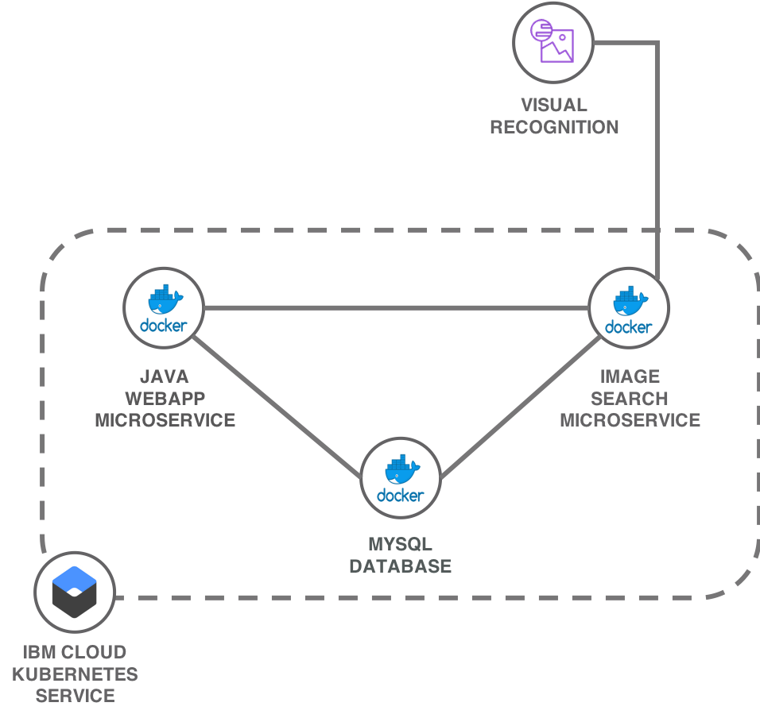
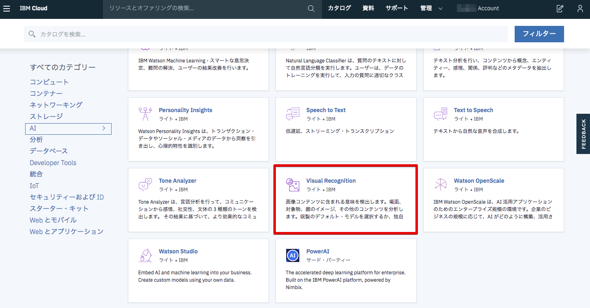
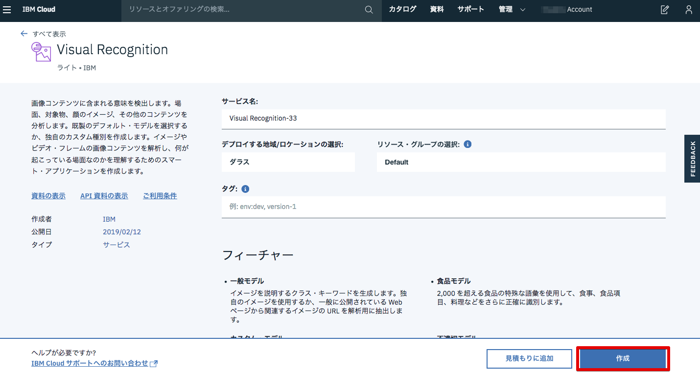
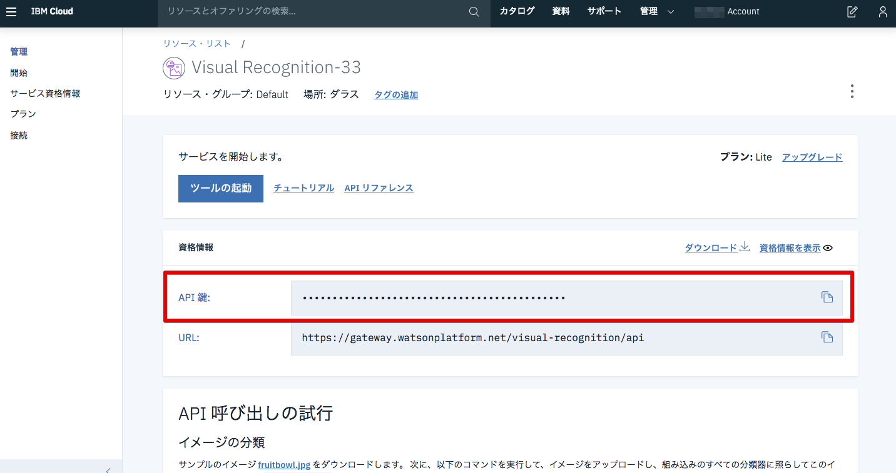

# Lab5) コンテナアプリケーションとWatson APIとの連携

このLabではクラウドサービスや外部APIをKubernetesから呼び出す方法について学びます。

フロント用Webアプリケーションと，画像イメージを格納したDBから成る`JpetStore`アプリケーションに対して機能拡張をしていきます。
具体的には，入力画像を画像認識して，JpetStoreのDB内に類似画像が存在するかどうかを応答として返してくれる機能を追加します。

この追加機能は新しいマイクロサービス`MMSSearch`として実装したものを使用し，IBM Cloudの画像認識サービス([Watson Visual Recognition](https://www.ibm.com/watson/services/visual-recognition/))に連携させて実現します。

>補足:
> `MMSSearch`はGo言語で書かれた画像認識機能をもつ(外部サービスを呼び出す)チャットアプリケーションです。



ここで実施する作業は以下の3つです。

- 1) IBM Cloud Visual Recognitionサービスの作成 (以降，VRサービス)
- 2) VRサービスにアクセスするためのAPI KeyをKuberneteリソースのSecretとして作成
- 3) `MMSSearch`アプリケーションのデプロイ

## 1) Visual Recognitionサービスの作成

1. ブラウザで [IBM Cloudのカタログページ](https://cloud.ibm.com/catalog/) にアクセスし，「AI」カテゴリにある「Visual Recognition」を選択します。

  

2. 以下のように設定されていることを確認して，「作成」をクリックしてサービスインスタンスを作成します。
  
  - サービス名: `Visual Recognition-xxx(ユニーク値)`
  - デプロイする地域: `ダラス(Dallas)`
  - リソース・グループの選択: `Default`
  - タグ: `(空欄)`
  - サービスプラン: `ライト（Lite）`

  >補足:  
  > 下図はイメージです。デフォルトで上記の値が埋め込まれていますので「作成」をクリックしてください（万一異なる設定となっている場合は上記のように変更してください。）
  > 
  > 
  > 

3. API呼び出しをするために必要な **API Key** を取得します。

  VRサービスが作成されると画面が自動遷移し，サービスの詳細画面が表示されます。
  
  下図を参考に「管理」メニューを開いて **API Key** をコピーしておいてください。
  
  

## 2) VRサービスにアクセスするためのAPI KeyをKuberneteリソースの`Secret`として作成

4. `Secret`を作成するための事前準備として，API Keyを外部ファイルとして用意します。

  テンプレートファイル **mms-secrets.json.template** を使用して， **mms-secrets.json** ファイルを作成します。
  
  実行例:

  ```bash
  jpetstore-kubernetes-min/mmssearcｈ ディレクトリで操作します。
  $ cp mms-secrets.json.template mms-secrets.json
  ```

5. `mms-secrets.json` にVRサービスのAPI Keyを貼り付けます。

  **mms-secrets.json**  を任意のエディタで開いて，以下を参考にVRサービスのAPI Keyを指定します。

  ```json
  {
    "watson":
    {
      "url": "https://gateway.watsonplatform.net/visual-recognition/api",
      "note": "It may take up to 5 minutes for this key to become active",
      "api_key": "XXXXXX 自身のVRサービスのAPI Keyを貼り付ける XXXXXX"
    }
  }
  ```

6. 手順5.で用意した`mms-secrets.json`を元にKuberenetesリソースのSecretを生成します。

  `kubectl create secret`コマンドで作成します。

  実行例: 

  ```bash
  jpetstore-kubernetes-min/mmssearchで操作します。
  $ kubectl create secret generic mms-secret --from-file=mms-secrets=./mms-secrets.json
  secret/mms-secret created
  ```

  `mms-secret`という名前で`Secret`が生成されました。  

  >補足1:  
  > 生成されたSecretは以下のように確認できます。
  > 
  > 実行例:
  > 
  > ```bash
  > $ kubectl get secret mms-secret -o yaml
  > apiVersion: v1
  > data:
  >  mms-secrets: ewogICJ3YXRzb24iOgogIHsKICAgICJ1cmwiOiAiaHR0cHM6Ly9nYXRld2F5LndhdHNvbnBsYXRmb3JtLm5ldC92aXN1YWwtcmVjb2duaXRpb24vYXBpIiwKICAgICJub3RlIjogIkl0IG1heSB0YWtlIHVwIHRvIDUgbWludXRlcyBmb3IgdGhpcyBrZXkgdG8gYmVjb21lIGFjdGl2ZSIsCiAgICAiYXBpX2tleSI6ICJ5cGtQNDhScUhfci1NMTdPRm4xV0p5bEtzVXZnNnc1RFFwOXBlMy1fMWRfSSIgCiAgfQp9Cg==
  > kind: Secret
  > metadata:
  >   creationTimestamp: 2019-02-14T10:29:03Z
  >   name: mms-secret
  >   namespace: default
  >   resourceVersion: "34546"
  >   selfLink: /api/v1/namespaces/default/secrets/mms-secret
  >   uid: 59cbcc9e-3043-11e9-9576-227f65586521
  > type: Opaque
  > ```
  > 
  > `data.mms-secrets:` にAPI Keyの情報が含まれています。Base64でエンコードされるため機密性を高く保つことができます。
  > 
  > 
  >補足2:  
  > 外部サービスを呼び出すためにはAPI KeyやユーザID/パスワードが必要となりますが，これらの情報はアプリケーションとは切り離して別の設定ファイルとして管理することが推奨されています。例えば，アプリケーションコードと一緒に機密性の高い情報をGitレポジトリ上に置くことが推奨されないことは理解しやすいかと思います。他にも管理負荷を下げるためにも分離した方が良いとされています。
  > 
  > ちなみに、Kubernetesで認証情報など設定系の情報を管理する方法としては`ConfigMap`や`Secret`を使用する方法があります。API Keyのような機密性の高い情報は`Secret`を使用することが推奨されています。ConfigMapとして生成した場合は暗号化されず平文のまま値が格納されてしまうためです。
  > 
  > 
  >補足3:  
  > IBM Cloud CLIを使ったSecretの生成
  > 
  > IBM Cloudでは、KubernetesクラスターとIBM Cloudのサービスの接続を容易にするためのコマンド`ibmcloud cs cluster-service-bind`が用意されています。この方法でも`Secret`を作成できます。詳しくは[こちら](https://cloud.ibm.com/docs/containers/cs_integrations.html#adding_cluster)を参照してください。 


## 3) `MMSSearch`アプリケーションのデプロイ

7. Helm チャートを使用してMMSSearchアプリケーションをデプロイします。

  `helm install`コマンドを使用します。
  
  MMSSearchのDeployment/Serviceなどを作成するHelmチャートは，`jpetstore-kubernetes-min/helm`ディレクトリに準備しています。
  
  実行例:
  
  ```bash
  helmディレクトリー移動 (jpetstore-kubernetes-min/helm)
  $ cd helm

  MMSSearchアプリのデプロイ
  $ helm install --name mmssearch ./mmssearch
  ```

  >補足1:  
  > Podのステータスを確認してみます。
  > 
  > ```bash
  > $ kubectl get pod -l app=mmssearch-mmssearch
  > NAME                                   READY   STATUS    RESTARTS   AGE
  > mmssearch-mmssearch-55b789857d-k8mwn   1/1     Running   0          2m
  > ```
  >
  > さらに`jpetstoreアプリ`と`mmssearchアプリ`に関連するKubernetesリソースをまとめて確認してみましょう。
  > 
  > ```bash
  > kubectl get all
  > NAME                                                     READY   STATUS    RESTARTS   AGE
  > pod/jpetstore-modernpets-jpetstoredb-7dd76668b5-crtql    1/1     Running   0          8m
  > pod/jpetstore-modernpets-jpetstoreweb-6d49474455-6j2j2   1/1     Running   0          8m
  > pod/jpetstore-modernpets-jpetstoreweb-6d49474455-tjc6g   1/1     Running   0          8m
  > pod/mmssearch-mmssearch-55b789857d-k8mwn                 1/1     Running   0          4m
  > 
  > NAME                 TYPE        CLUSTER-IP       EXTERNAL-IP   PORT(S)          AGE
  > service/db           ClusterIP   172.21.240.192   <none>        3306/TCP         8m
  > service/kubernetes   ClusterIP   172.21.0.1       <none>        443/TCP          1d
  > service/mmssearch    NodePort    172.21.19.130    <none>        8080:31417/TCP   4m
  > service/web          NodePort    172.21.214.98    <none>        80:32025/TCP     8m
  > 
  > NAME                                                DESIRED   CURRENT   UP-TO-DATE   AVAILABLE   AGE
  > deployment.apps/jpetstore-modernpets-jpetstoredb    1         1         1            1           8m
  > deployment.apps/jpetstore-modernpets-jpetstoreweb   2         2         2            2           8m
  > deployment.apps/mmssearch-mmssearch                 1         1         1            1           4m
  > 
  > NAME                                                           DESIRED   CURRENT   READY   AGE
  > replicaset.apps/jpetstore-modernpets-jpetstoredb-7dd76668b5    1         1         1       8m
  > replicaset.apps/jpetstore-modernpets-jpetstoreweb-6d49474455   2         2         2       8m
  > replicaset.apps/mmssearch-mmssearch-55b789857d                 1         1         1       4m
  
  以上でMMSSearchアプリがデプロイされました。


  >補足2:  
  > yamlファイルを使用してデプロイする場合は以下のようになります。(**今回は実施しません**)
  > 
  > ```bash
  > #jpetstore-kubernetes-min/jpetstore ディレクトリに移動
  > $ cd jpetstore
  > $ kubectl apply -f jpetstore-watson.yaml
  > service "mmssearch" created
  > deployment.extensions "mmssearch" created
  > ```

## 動作確認

8. ブラウザ上でアプリケーションの動作を確認します。

    ブラウザで`<Public IP>:<NodePort>`を開きます。
    
    >補足:  
    > ワーカーノードの `Public IP` は以下のように確認します。
    > 
    > ```bash
    > $ ibmcloud cs workers mycluster
    > OK
    > ID                                                 Public IP       Private IP      Machine Type   State    Status   Zone    Version
    > kube-hou02-pa705552a5a95d4bf3988c678b438ea9ec-w1   184.173.52.92   10.76.217.175   free           normal   Ready    hou02   1.10.12_1543
    > ```
    > `NodePort` は以下のように確認します。
    > 
    > ```bash
    > $ kubectl get service mmssearch
    > NAME        TYPE       CLUSTER-IP      EXTERNAL-IP   PORT(S)          AGE
    > mmssearch   NodePort   172.21.19.130   <none>        8080:31417/TCP   19m
    > ```
    > 
    > 上記の出力例の場合の `<Public IP>:<NodePort>`は，次のようになります。
    > 
    > - Public IP: `184.173.52.92`
    > - NodePort: `31417`
    > 
    > したがって，ブラウザ上で `184.173.52.92:31417` にアクセスするとアプリケーションが開きます。


    ブラウザで`<クラスターのPublic IP>:<ポート>`にアクセスしてください。
    
    `jpetstore-kubernetes-min/pet-images`ディレクトリにある動物の画像をアップロードすると，Watson Visual Recognitionによる画像認識が行われ，認識した結果（動物の種類）が`JpetStore`データベースに登録されている動物かどうかが返ってきます。

   

以上でコンテナアプリケーションとWatson APIを連携させる操作は完了です。

最後に， **Lab5で作成したK8sリソースを以下のコマンドで削除** します。

  ```bash
  1) Lab4, 5でデプロイした2つのアプリを削除します。
  $ helm delete jpetstore --purge
  $ helm delete mmssearch --purge
  
  2) クラスターに保存されているSecretを削除します。
  $ kubectl delete secret mms-secret
  ```
  
次のハンズオンはこちら [Lab6](../Lab6/README.md) です。

*******

### 参考: Kubernetes上のアプリケーションから外部サービスを呼び出すためのマニフェストファイルの設定について

実際にアプリケーションから読み出す方法は`Secret`を**Volumeとしてマウント**する方法と，**環境変数として参照**する方法があります。
`MMSSearch`では以下のようにVolumeとしてマウントする方法で実装されています。

```yaml
    #中略
    spec:
        volumeMounts:
         - name: service-secrets
           mountPath: "/etc/secrets"
           readOnly: true
      volumes:
      - name: service-secrets
        secret:
          secretName: mms-secret
          items:
          - key: mms-secrets
            path: mms-secrets.json
```

>mms-secretという名前のsecret(`secretName: mms-secret`)が`/etc/secret`に`mms-secrets.json`としてマウントされます。アプリケーションはこのファイル経由でsecretを参照します。
