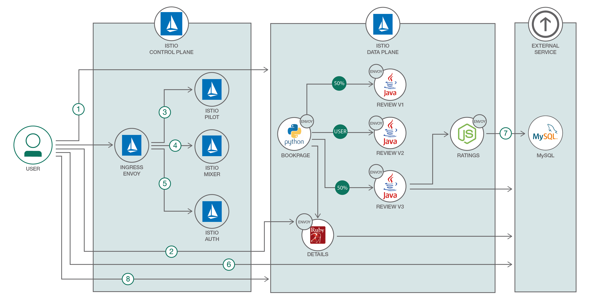

# LabX 
まだまだあるよ! Kubernetesの追加学習コンテンツの一覧

## IBM Cloud Docs
  IBM Cloud のドキュメント。機能紹介、API紹介、チュートリアルをご提供

* IBM Cloud Kubernetes Service 概説

  https://cloud.ibm.com/docs/containers?topic=containers-getting-started#getting-started

* ロギングとモニタリング

  https://cloud.ibm.com/docs/containers?topic=containers-health#health

* Using the managed Istio add-on (beta) **#istio**

  https://cloud.ibm.com/docs/containers?topic=containers-istio&locale=en#istio

* Using managed Knative to run serverless apps in Kubernetes clusters **#knative**

  https://cloud.ibm.com/docs/containers?topic=containers-knative_tutorial&locale=en#knative_tutorial

## IBM Developer - Courses
自己学習用の研修コースをご提供。研修終了後に**バッジ**が取得できます！

* Docker Essentials: A Developer Introduction - Cognitive Class **#container**

  https://cognitiveclass.ai/courses/docker-essentials/

* Kubernetes and containers on IBM Cloud - Free Kubernetes course by IBM Cognitive Class **#kubernetes**

  https://cognitiveclass.ai/courses/kubernetes-course/

* Microservices and Istio on IBM Cloud - Free Microservice course on IBM Cognitive Class **#istio**

  https://cognitiveclass.ai/courses/get-started-with-microservices-istio-and-ibm-cloud-container-service/

* Istio, microservices, and Kubernetes - free course on managing microservices traffic, health, and security **#istio**

  https://cognitiveclass.ai/courses/beyond-the-basics-istio-and-ibm-cloud-kubernetes-service/

## IBM Developer - Code Patterns
様々なテクノロジーを組み合わせ、実践的なパターン化したアプリをコードとともにご提供。

* Istio を使用して、高度なトラフィック管理機能とリクエスト追跡機能を備えたマイクロサービスを実現する **#istio**

  
  https://developer.ibm.com/jp/patterns/manage-microservices-traffic-using-istio/

* Kubernetes 上に Java マイクロサービスをデプロイして多言語に対応する

  https://developer.ibm.com/jp/patterns/deploy-java-microservices-on-kubernetes-with-polyglot-support/

## IBM Developer - Series

* Learning Path: Kubernetes

  https://developer.ibm.com/series/kubernetes-learning-path/

## 外部
* kubernetes-the-hard-way: Bootstrap Kubernetes the hard way on Google Cloud Platform. No scripts.

  https://github.com/kelseyhightower/kubernetes-the-hard-way

* Certified Kubernetes Administrator（CKA）を取得した - Qiita

  https://qiita.com/oke-py/items/46ecb3f530a92273b130